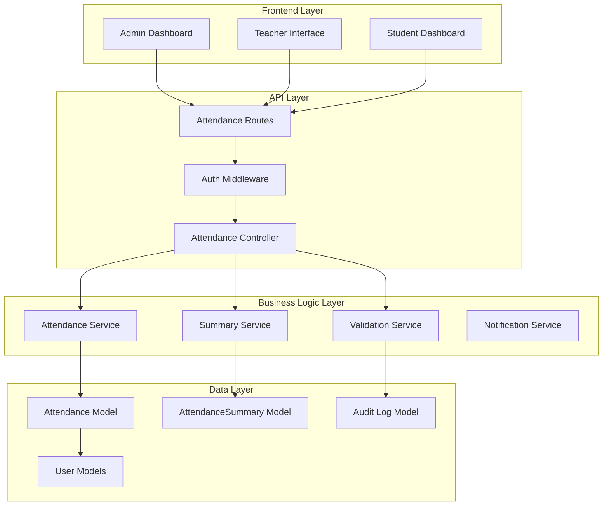
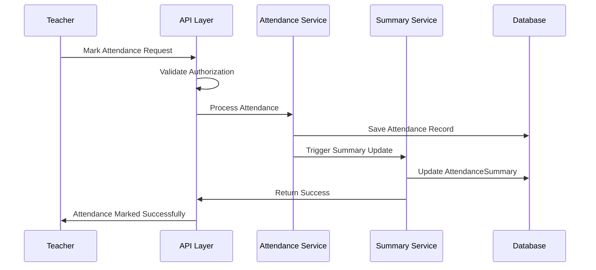

# Design Document

## Overview

The attendance system revamp will transform the current basic attendance tracking into a comprehensive, session-based system with proper authorization controls, automated summary generation, and enhanced analytics. The new design addresses the limitations of the current system where attendance is stored as simple arrays in student documents, lacks session tracking, and has minimal access controls.

The revamped system introduces new data models for structured attendance tracking, implements role-based access controls, provides real-time summary calculations, and offers comprehensive reporting capabilities for all user roles.

## Architecture

### High-Level Architecture



### Data Flow Architecture



## Components and Interfaces

### 1. Data Models

#### AttendanceRecord Model
```javascript
{
  _id: ObjectId,
  classId: ObjectId, // Reference to sclass
  subjectId: ObjectId, // Reference to subject
  teacherId: ObjectId, // Reference to teacher
  studentId: ObjectId, // Reference to student
  date: Date,
  session: String, // "Lecture 1", "Lecture 2", "Lab 1", etc.
  status: String, // "present", "absent", "late", "excused"
  markedBy: ObjectId, // Reference to user who marked
  markedAt: Date,
  lastModifiedBy: ObjectId,
  lastModifiedAt: Date,
  schoolId: ObjectId // Reference to admin/school
}
```

#### AttendanceSummary Model
```javascript
{
  _id: ObjectId,
  studentId: ObjectId,
  subjectId: ObjectId,
  classId: ObjectId,
  totalSessions: Number,
  presentCount: Number,
  absentCount: Number,
  lateCount: Number,
  excusedCount: Number,
  attendancePercentage: Number,
  lastUpdated: Date,
  schoolId: ObjectId
}
```

#### AttendanceAuditLog Model
```javascript
{
  _id: ObjectId,
  recordId: ObjectId, // Reference to AttendanceRecord
  action: String, // "create", "update", "delete"
  oldValues: Object,
  newValues: Object,
  performedBy: ObjectId,
  performedAt: Date,
  reason: String,
  schoolId: ObjectId
}
```

#### SessionConfiguration Model
```javascript
{
  _id: ObjectId,
  subjectId: ObjectId,
  classId: ObjectId,
  sessionType: String, // "lecture", "lab", "tutorial"
  sessionsPerWeek: Number,
  sessionDuration: Number, // in minutes
  totalSessions: Number,
  schoolId: ObjectId
}
```

### 2. Service Layer Components

#### AttendanceService
- **markAttendance(attendanceData)**: Validates and creates attendance records
- **updateAttendance(recordId, updateData)**: Updates existing attendance with audit logging
- **getAttendanceByFilters(filters)**: Retrieves attendance records with filtering
- **validateAttendancePermissions(userId, classId, subjectId)**: Checks authorization
- **bulkMarkAttendance(attendanceList)**: Handles bulk attendance marking

#### SummaryService
- **updateStudentSummary(studentId, subjectId)**: Recalculates attendance summary
- **bulkUpdateSummaries(classId, subjectId)**: Updates summaries for entire class
- **calculateAttendancePercentage(summary)**: Computes attendance percentage
- **getStudentSummaries(studentId, filters)**: Retrieves student attendance summaries

#### ValidationService
- **validateTeacherAssignment(teacherId, classId, subjectId)**: Verifies teacher authorization
- **validateStudentEnrollment(studentId, classId)**: Confirms student enrollment
- **validateSessionConfiguration(classId, subjectId, session)**: Checks session validity
- **validateDateRange(date)**: Ensures attendance date is within valid range

#### BulkManagementService
- **assignStudentsByPattern(pattern, classId)**: Auto-assigns students based on ID patterns
- **transferStudentAssignments(studentIds, fromClass, toClass)**: Handles student transfers
- **reassignTeacher(fromTeacher, toTeacher, subjects)**: Manages teacher reassignments

### 3. API Endpoints

#### Attendance Management
- `POST /api/attendance/mark` - Mark attendance for a session
- `PUT /api/attendance/:id` - Update existing attendance record
- `GET /api/attendance/class/:classId/subject/:subjectId` - Get attendance for class/subject
- `GET /api/attendance/student/:studentId` - Get student's attendance records
- `DELETE /api/attendance/:id` - Delete attendance record (admin only)

#### Summary and Analytics
- `GET /api/attendance/summary/student/:studentId` - Get student attendance summary
- `GET /api/attendance/summary/class/:classId` - Get class attendance summary
- `GET /api/attendance/analytics/school/:schoolId` - Get school-wide analytics
- `GET /api/attendance/reports/export` - Export attendance reports

#### Bulk Operations
- `POST /api/attendance/bulk/assign-students` - Bulk assign students by pattern
- `POST /api/attendance/bulk/mark` - Bulk mark attendance
- `PUT /api/attendance/bulk/transfer` - Bulk transfer assignments

### 4. Frontend Components

#### Teacher Interface Components
- **AttendanceMarkingGrid**: Enhanced interactive grid with improved UI/UX
  - Student list display: Roll number first, followed by name
  - Individual Present/Absent checkboxes for each student
  - Visual feedback: Green checkboxes for Present, Red for Absent
  - Mutual exclusivity: Only one status per student can be selected
  - Individual student control: Clicking one student doesn't affect others
- **SessionSelector**: Dropdown for selecting date and session
- **AttendanceHistory**: View and edit past attendance records
- **AttendanceSummaryView**: Display session summary after marking

#### Student Interface Components
- **AttendanceDashboard**: Overview of attendance across all subjects
- **AttendanceChart**: Visual representation of attendance trends
- **SubjectAttendanceDetail**: Detailed view for specific subject
- **AttendanceCalendar**: Calendar view of attendance records

#### Admin Interface Components
- **AttendanceAnalytics**: Comprehensive analytics dashboard
- **BulkStudentManager**: Interface for bulk student operations
- **AttendanceReports**: Report generation and export functionality
- **AuditLogViewer**: View attendance modification history
- **TeacherAssignmentManager**: Manage teacher-subject assignments

## Data Models

### Enhanced Student Schema
```javascript
const studentSchema = new mongoose.Schema({
    name: { type: String, required: true },
    rollNum: { type: Number, required: true },
    universityId: { type: String, required: true }, // New field for pattern matching
    password: { type: String, required: true },
    sclassName: { type: mongoose.Schema.Types.ObjectId, ref: 'sclass', required: true },
    school: { type: mongoose.Schema.Types.ObjectId, ref: 'admin', required: true },
    role: { type: String, default: "Student" },
    enrolledSubjects: [{ // New field for explicit subject enrollment
        subjectId: { type: mongoose.Schema.Types.ObjectId, ref: 'subject' },
        enrolledAt: { type: Date, default: Date.now }
    }],
    examResult: [/* existing structure */],
    // Remove old attendance array - will be replaced by AttendanceRecord collection
}, { timestamps: true });
```

### Enhanced Teacher Schema
```javascript
const teacherSchema = new mongoose.Schema({
    name: { type: String, required: true },
    email: { type: String, unique: true, required: true },
    password: { type: String, required: true },
    role: { type: String, default: "Teacher" },
    school: { type: mongoose.Schema.Types.ObjectId, ref: 'admin', required: true },
    assignedSubjects: [{ // Enhanced to support multiple subjects
        subjectId: { type: mongoose.Schema.Types.ObjectId, ref: 'subject' },
        classId: { type: mongoose.Schema.Types.ObjectId, ref: 'sclass' },
        assignedAt: { type: Date, default: Date.now }
    }],
    // Remove old attendance tracking - will be handled by AttendanceRecord
}, { timestamps: true });
```

## Error Handling

### Error Categories
1. **Authorization Errors**: Unauthorized access attempts
2. **Validation Errors**: Invalid data or business rule violations
3. **Concurrency Errors**: Simultaneous update conflicts
4. **System Errors**: Database or service failures

### Error Response Format
```javascript
{
    success: false,
    error: {
        code: "ATTENDANCE_UNAUTHORIZED",
        message: "Teacher not assigned to this class/subject",
        details: {
            teacherId: "...",
            classId: "...",
            subjectId: "..."
        }
    }
}
```

### Error Handling Strategies
- **Graceful Degradation**: System continues to function with reduced capabilities
- **Automatic Retry**: Retry failed operations with exponential backoff
- **Audit Logging**: Log all errors for debugging and monitoring
- **User Feedback**: Provide clear, actionable error messages

## Testing Strategy

### Unit Testing
- **Model Validation**: Test all schema validations and constraints
- **Service Logic**: Test business logic in isolation
- **Utility Functions**: Test helper functions and calculations
- **Error Scenarios**: Test error handling and edge cases

### Integration Testing
- **API Endpoints**: Test complete request-response cycles
- **Database Operations**: Test CRUD operations and transactions
- **Service Interactions**: Test communication between services
- **Authentication Flow**: Test role-based access controls

### End-to-End Testing
- **User Workflows**: Test complete user journeys
- **Cross-Role Interactions**: Test admin-teacher-student interactions
- **Data Consistency**: Test data integrity across operations
- **Performance Testing**: Test system under load

### Test Data Management
- **Seed Data**: Consistent test data for all environments
- **Data Cleanup**: Automated cleanup after test runs
- **Mock Services**: Mock external dependencies
- **Test Isolation**: Ensure tests don't interfere with each other

## UI/UX Design Specifications

### Attendance Marking Interface

#### Layout Structure
```
┌─────────────────────────────────────────────────────────────┐
│ Session Details                                             │
│ Date: [Date Picker] | Session: [Dropdown]                  │
├─────────────────────────────────────────────────────────────┤
│ Student List                                                │
│ ┌─────┬──────────────────┬─────────┬─────────┬─────────────┐ │
│ │ Roll│ Student Name     │ Present │ Absent  │ Late        │ │
│ ├─────┼──────────────────┼─────────┼─────────┼─────────────┤ │
│ │ 001 │ MAYANK BISHT     │ [✓]     │ [ ]     │ [ ]         │ │
│ │ 002 │ ARYAN SHARMA     │ [ ]     │ [✗]     │ [ ]         │ │
│ │ 003 │ PRIYA GUPTA      │ [✓]     │ [ ]     │ [ ]         │ │
│ └─────┴──────────────────┴─────────┴─────────┴─────────────┘ │
├─────────────────────────────────────────────────────────────┤
│ Summary: Present: 2, Absent: 1, Late: 0                    │
│ [Save Attendance] [Cancel]                                  │
└─────────────────────────────────────────────────────────────┘
```

#### Visual Design Elements

**Student Row Layout:**
- Roll number displayed prominently in the first column (bold, larger font)
- Student name in the second column (regular font weight)
- Checkbox controls in separate columns for clear visual separation

**Checkbox Behavior:**
- **Present Checkbox**: 
  - Default state: Empty white checkbox with border
  - Selected state: Green background (#4CAF50) with white checkmark
  - When clicked: Automatically unchecks Absent and Late checkboxes
- **Absent Checkbox**:
  - Default state: Empty white checkbox with border
  - Selected state: Red background (#F44336) with white X mark
  - When clicked: Automatically unchecks Present and Late checkboxes
- **Late Checkbox**:
  - Default state: Empty white checkbox with border
  - Selected state: Orange background (#FF9800) with white clock icon
  - When clicked: Automatically unchecks Present and Absent checkboxes

**Interactive Behavior:**
- Each student row operates independently
- Clicking a checkbox for one student does not affect other students
- Visual feedback is immediate (no delay)
- Hover effects on checkboxes for better user experience

#### Component State Management

```javascript
// Individual student attendance state
const studentAttendanceState = {
  studentId: String,
  rollNum: String,
  name: String,
  status: 'present' | 'absent' | 'late' | null,
  isModified: Boolean
};

// Overall attendance session state
const attendanceSessionState = {
  classId: String,
  subjectId: String,
  date: Date,
  session: String,
  students: Array<studentAttendanceState>,
  summary: {
    present: Number,
    absent: Number,
    late: Number,
    total: Number
  }
};
```

#### Responsive Design Considerations
- Mobile view: Stack checkboxes vertically under student name
- Tablet view: Maintain table layout with adjusted column widths
- Desktop view: Full table layout as specified above

### Error Prevention and User Feedback

#### Real-time Validation
- Prevent submission if no students have attendance marked
- Show warning if large number of students marked absent
- Confirm before saving if significant changes from previous session

#### Success Feedback
- Green toast notification on successful save
- Updated summary counts immediately visible
- Clear indication of which students' attendance was modified

## Security Considerations

### Authentication and Authorization
- **JWT Token Validation**: Verify user identity on each request
- **Role-Based Access Control**: Enforce permissions based on user roles
- **Resource-Level Authorization**: Check permissions for specific resources
- **Session Management**: Handle token expiration and refresh

### Data Protection
- **Input Validation**: Sanitize and validate all input data
- **SQL Injection Prevention**: Use parameterized queries
- **XSS Protection**: Escape output data appropriately
- **CSRF Protection**: Implement CSRF tokens for state-changing operations

### Audit and Monitoring
- **Access Logging**: Log all access attempts and operations
- **Change Tracking**: Track all data modifications
- **Anomaly Detection**: Monitor for unusual access patterns
- **Security Alerts**: Alert administrators of security events

## Performance Optimization

### Database Optimization
- **Indexing Strategy**: Create indexes on frequently queried fields
- **Query Optimization**: Optimize database queries for performance
- **Connection Pooling**: Manage database connections efficiently
- **Caching Strategy**: Cache frequently accessed data

### API Performance
- **Response Compression**: Compress API responses
- **Pagination**: Implement pagination for large datasets
- **Rate Limiting**: Prevent API abuse
- **Caching Headers**: Set appropriate cache headers

### Frontend Optimization
- **Lazy Loading**: Load components and data on demand
- **State Management**: Optimize Redux state structure
- **Bundle Optimization**: Minimize JavaScript bundle size
- **Image Optimization**: Optimize images for web delivery